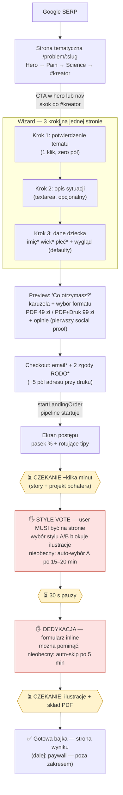

# Konwersja góry lejka: od wejścia z Google do wygenerowanej bajki

**Data:** 2026-07-19 (rewrite — poprzednia wersja skupiała się na dole lejka)
**Zakres:** visitor z SEO → strona tematyczna → wizard → **ukończona generacja bajki**.
**Poza zakresem:** paywall, checkout Stripe, płatność — to osobny wątek. Mail z pełnym PDF przed płatnością jest już uszczelniony (mail wychodzi po płatności) i NIE jest tematem tego dokumentu.

Wszystko poniżej wynika z lektury kodu (ścieżki plików w nawiasach), nie z domysłów.

---

## 1. Lejek: SEO → wygenerowana bajka

Użytkownik wchodzi z Google na `/problem/:slug` (15 stron tematycznych, SSG). Wizard jest osadzony inline na dole tej samej strony (`#kreator`). Po submisji checkoutu pipeline startuje **od razu** — płatność jest dopiero na stronie wyniku, więc "ukończona generacja" to realny, darmowy dla usera punkt konwersji.

Punkty oznaczone 🖐 wymagają **obecności i kliknięcia** użytkownika w trakcie generacji — każdy z nich to potencjalny punkt odpadu przed ukończeniem bajki. Punkty ⏳ to czyste czekanie.

### Gdzie user czeka albo musi wrócić (twarde liczby z kodu)

| Punkt | Co się dzieje | Timing | Źródło |
|---|---|---|---|
| Style vote | Tor ilustracji **stoi**, dopóki rodzic nie wybierze stylu A/B | auto-wybór A po 15 min, cron sprawdza co 5 min → realnie **15–20 min przestoju** dla nieobecnych | `convex/bookPipelineHelpers.ts` (`STYLE_VOTE_TIMEOUT_MS`), `convex/crons.ts` |
| Dedykacja | Formularz pojawia się 30 s po głosowaniu; skład PDF czeka na decyzję | auto-skip po **5 min**, więc bramka miękka | `convex/bookAgents.ts` (`DEDICATION_TIMEOUT_MS`), `BookProgressShell.tsx` |
| Obietnica z hero | „Bajka gotowa do czytania w 15 minut" | nieosiągalna dla rodzica, który zamknie kartę — sam style vote dodaje do 20 min | `TopicHero.tsx` |
| Powrót do procesu | Token zamówienia tylko w localStorage — **ta sama przeglądarka albo nic** | żaden mail z linkiem nie wychodzi przed ukończeniem książki | `useLandingOrderToken`, `convex/email.ts` |

---

## 2. Punkty tarcia i odpadu (z kodu)

### 2.1 Strona tematyczna — droga do wizarda

- **CTA w hero jest nad foldem** i skacze kotwicą prosto do wizarda — to działa. Sticky nav ma drugi CTA, który chowa się, gdy wizard jest widoczny (`TopicNav.tsx`). Dobre.
- **Organiczny scroll przechodzi przez dwie długie sekcje bez żadnego przycisku.** Sekcja Pain kończy się mocnym zdaniem wezwania (`painCta` — „daj dziecku historię o Bohaterze...") wyrenderowanym jako **karta tekstowa bez buttona** (`TopicPain.tsx`). Emocjonalny szczyt strony nie ma kliku.
- **Zero ceny na stronie tematycznej.** 49/99 zł pojawia się dopiero na ekranie preview, w środku wizarda. Cennik jest tylko linkiem w nav.
- **Zero social proof przed wizardem.** Trzy opinie istnieją, ale renderują się dopiero na ekranie preview (`OrderPreview.tsx`) — user, który nie wszedł do wizarda, nigdy ich nie zobaczy.

### 2.2 Wizard — liczba ekranów i pól

Od kliknięcia CTA do startu generacji: **7 ekranów/kliknięć**, w tym 6 wymaganych inputów (imię, wiek, płeć, email, 2 zgody RODO).

| Ekran | Pola wymagane | Pola opcjonalne | Uwagi |
|---|---|---|---|
| Krok 1: potwierdzenie tematu | — | — | **Redundantny dla wejścia z topic page** — user właśnie kliknął CTA na stronie tego tematu, a pierwszy ekran pyta „czy to ten temat?" (`OrderWizard.tsx`, `StepTopic`) |
| Krok 2: opis sytuacji | — | textarea | OK — opcjonalny, z łagodną zachętą |
| Krok 3: dane dziecka | imię (≥2 znaki), wiek (2–12), płeć | oczy/włosy/długość (selecty z defaultami: Niebieskie/Blond/Krótkie), okulary, zabawka, strój | Jedna strona, rozsądnie skondensowane |
| Preview | wybór formatu (default PDF) | — | Karuzela + lista wartości + opinie |
| Checkout | email, 2 checkboxy zgód | (druk: +5 pól adresu) | Submit → generacja startuje |

- **Email zbierany na SAMYM końcu.** Odpad w krokach 1–3 lub na preview = zero kontaktu, zero możliwości odzyskania (`OrderCheckout.tsx` — jedyne miejsce z polem email).
- **Stan wizarda żyje tylko w pamięci Reacta** (`LandingOrderFlow.tsx` — `useState`, brak persystencji). Refresh, przypadkowe zamknięcie karty, wyrzucenie taba z pamięci na mobile — wszystko od zera. Na mobile to realny scenariusz, nie edge case.

### 2.3 W trakcie generacji

- **Style vote to najtwardszy strukturalny punkt odpadu.** Pipeline zatrzymuje tor ilustracji do decyzji rodzica. Rodzic, który uwierzył w „15 minut" i poszedł zrobić herbatę na 20 minut, wraca do procesu opóźnionego o kwadrans — albo nie wraca wcale. Nic go nie woła z powrotem: brak maila, brak powiadomienia.
- **Dedykacja jest OK.** Pojawia się w naturalnym oknie czekania (30 s po głosowaniu, gdy ilustracje i tak się rysują), ma przycisk „pomiń", a backend auto-skipuje po 5 min. Wzorzec do naśladowania — style vote powinien działać podobnie.
- **Batch mode już dziś omija pauzę style vote**: jeśli `chosenStyle` jest ustawiony przed A6, pipeline leci dalej bez zatrzymania (`convex/bookAgents.ts`, `designCharacter`). Czyli architektura na „wybór stylu przed generacją" **już istnieje**.

### 2.4 Pomiar — co widzimy, a czego nie

- **PostHog: pełny funnel klientowy istnieje** — `cta_create_book_clicked`, `topic_selected`, `order_form_step_viewed/completed` (z czasem trwania kroku), `preview_viewed`, `checkout_viewed`, `checkout_submit_clicked`, `progress_viewed`, `style_vote_viewed/submitted`, `dedication_submitted/skipped`, `result_viewed` (`src/lib/telemetry.ts`). Odpady per krok wizarda **da się policzyć już dziś** — pytanie, czy ktoś na te lejki patrzy.
- **GA4/Google Ads widzi tylko `purchase` i `book_generated`** (`src/lib/gtag.ts`). Zero mid-funnel eventów → Smart Bidding nie może optymalizować pod starty wizarda ani submisje checkoutu, i nie zbudujemy w Ads audiencji remarketingowej „zaczął wizard, nie skończył".
- **Backend-owe odpady są niewidzialne.** Auto-wybór stylu po timeoucie i auto-skip dedykacji dzieją się w Convex i nie emitują żadnego eventu produktowego. **Nie wiemy, jaki procent rodziców nigdy nie wraca do głosowania** — a to kluczowa liczba do decyzji o P2 poniżej.

### 2.5 SEO / dopasowanie intencji

- Meta title, description, canonical, og: — jest (`src/routes/topic.tsx`). **Brak JSON-LD** (FAQPage, Product, BreadcrumbList) — tracimy rich snippets w SERP.
- **Tytuły niejednolite względem intencji wyszukiwania**: „Bajkoterapia – Dziecko Nie Chce Iść do Przedszkola | Adaptacja" trafia w frazę, ale np. „Bajkoterapia - Opanuj dziecięcą złość magią" nie zawiera frazy, którą rodzic realnie wpisuje („dziecko bije inne dzieci"). H1 na stronie jest pytaniowe i dobre — title'y powinny być równie konsekwentne.

---

## 3. Propozycje poprawy konwersji visitor → wygenerowana bajka

### P1. Email wcześniej + link powrotny do procesu

**Co:** przenieść pole email z checkoutu do kroku 3 wizarda (albo jako osobny mikro-krok przed preview). Po starcie generacji wysłać krótki mail z linkiem do strony postępu (link z tokenem per-order, który już istnieje w URL-owym mechanizmie `captureLandingOrderTokenFromUrl`).
**Dlaczego:** dziś odpad przed checkoutem = user stracony bezpowrotnie, a zamknięcie karty w trakcie generacji = utrata dostępu (token tylko w localStorage). Email w środku lejka daje: (a) recovery porzuconego wizarda, (b) „wróć i wybierz styl", (c) dostęp z innego urządzenia. To NIE jest mail z PDF-em — tylko link do procesu; uszczelnienie PDF-a pozostaje nietknięte.
**Effort:** M · **Impact:** wysoki

### P2. Wybór stylu w wizardzie zamiast blokującego style vote

**Co:** pokazać dwa statyczne przykłady stylów (A/B) jako wybór w kroku 3 lub na preview, ustawiać `chosenStyle` przy tworzeniu zamówienia. Pipeline już dziś omija pauzę, gdy styl jest wybrany (ścieżka batch mode w `designCharacter`).
**Dlaczego:** usuwa jedyny twardy „musisz tu być i kliknąć" z generacji. Bajka robi się od startu do końca bez udziału rodzica — obietnica „15 minut" staje się prawdziwa także dla tych, którzy zamkną kartę. Koszt: przykłady stylów będą generyczne, nie spersonalizowane pod dziecko (trade-off do dyskusji — pytanie 1 w sekcji 5).
**Effort:** M · **Impact:** wysoki

### P3. Skrócenie auto-wyboru stylu: 15 min → 5 min (interim, jeśli P2 nie od razu)

**Co:** zmiana `STYLE_VOTE_TIMEOUT_MS` na 5 min i/lub gęstszy cron. Jednolinijkowa zmiana konfiguracji.
**Dlaczego:** tnie maksymalny przestój z 15–20 min do 5–10 min. Nie usuwa problemu, ale zmniejsza karę za zamknięcie karty o dwie trzecie.
**Effort:** S · **Impact:** średni

### P4. Persystencja stanu wizarda w localStorage

**Co:** zapisywać `IntakeState` przy każdej zmianie, odtwarzać przy powrocie na stronę tematu (z banerkiem „Dokończ bajkę dla Zosi").
**Dlaczego:** dziś refresh lub ubity tab na mobile kasuje cały wpisany formularz. Odzyskanie usera, który już zainwestował dane dziecka, jest tańsze niż pozyskanie nowego kliku z Google.
**Effort:** S · **Impact:** średni–wysoki

### P5. Usunięcie kroku 1 wizarda dla wejścia z topic page

**Co:** landing flow ma temat z URL-a — krok „potwierdź temat" scalić z krokiem opisu sytuacji (temat jako potwierdzony nagłówek nad textarea, z linkiem „zmień"). Nagłówek wizarda i tak już pokazuje wybrany temat.
**Dlaczego:** jeden pełnoekranowy klik mniej w lejcu, który ma ich siedem. Krok 1 nie zbiera żadnych danych.
**Effort:** S · **Impact:** średni

### P6. CTA po sekcji Pain + social proof i cena przy hero

**Co:** (a) dodać button pod `painCta` w `TopicPain` (kotwica `#kreator`), (b) przenieść/duplikować jedną-dwie opinie z ekranu preview na stronę tematyczną, (c) mikrocena przy CTA („od 49 zł" — do decyzji, pytanie 5).
**Dlaczego:** emocjonalny szczyt strony (koniec sekcji Pain) nie ma dziś kliku; social proof widzą tylko ci, którzy już weszli do wizarda; brak ceny przed checkoutem to odroczony szok cenowy.
**Effort:** S · **Impact:** średni

### P7. Mid-funnel eventy do GA4/Ads

**Co:** dublować kluczowe eventy PostHog do gtag: start wizarda, ukończenie kroku 3, submisja checkoutu (i istniejący `book_generated`). Wzorzec już jest w `gtag.ts`.
**Dlaczego:** bez tego Google Ads optymalizuje w ciemno pod rzadkie konwersje końcowe i nie da się budować audiencji remarketingowych na porzucających. To enabler dla całej reszty płatnego ruchu.
**Effort:** S · **Impact:** średni–wysoki (mnożnik dla Ads)

### P8. Serwerowe eventy odpadu z pipeline'u

**Co:** emitować z Convex eventy produktowe (PostHog server-side): `style_vote_auto_resolved`, `dedication_auto_skipped`, `pipeline_completed`. Skrzyżować z klientowym `result_viewed`.
**Dlaczego:** dziś nie wiemy, ilu rodziców znika w trakcie generacji i nigdy nie widzi gotowej bajki. Ta liczba rozstrzyga, ile naprawdę warte są P1/P2/P3.
**Effort:** S · **Impact:** średni (pomiar — warunek świadomych decyzji)

### P9. JSON-LD + ujednolicenie meta title pod frazy

**Co:** dodać FAQPage/Product/BreadcrumbList schema do stron tematycznych; przejrzeć 15 title'ów pod realne frazy rodziców (wzorzec: „przedszkole" tak, „magia złości" nie).
**Dlaczego:** wyższy CTR z SERP i lepsze dopasowanie intencji = więcej i lepszego ruchu na wejściu do tego samego lejka.
**Effort:** S–M · **Impact:** niski–średni (działa na wolumen, nie na konwersję)

### P10. Uczciwe zarządzanie oczekiwaniem na stronie postępu

**Co:** komunikat na progresie: „Za chwilę poprosimy Cię o wybór stylu — zostań z nami ~X min" (przed P2), a po wdrożeniu P1: „Możesz zamknąć stronę — wyślemy link mailem".
**Dlaczego:** hero obiecuje 15 minut, ale nie mówi, że trzeba być obecnym. Użytkownik, który wie, czego się spodziewać, nie znika w najgorszym momencie.
**Effort:** S · **Impact:** średni

---

## 4. Impact vs effort i rekomendowane pierwsze kroki

| # | Propozycja | Effort | Impact | Typ |
|---|---|---|---|---|
| P1 | Email wcześniej + link powrotny | M | wysoki | strukturalny |
| P2 | Wybór stylu w wizardzie | M | wysoki | strukturalny |
| P4 | Persystencja wizarda | S | średni–wysoki | quick win |
| P7 | Mid-funnel eventy GA4/Ads | S | średni–wysoki | pomiar/enabler |
| P3 | Timeout stylu 15→5 min | S | średni | quick win (interim) |
| P5 | Scalenie kroku 1 | S | średni | quick win |
| P6 | CTA po Pain + social proof | S | średni | quick win |
| P8 | Serwerowe eventy odpadu | S | średni | pomiar |
| P10 | Zarządzanie oczekiwaniem | S | średni | quick win |
| P9 | JSON-LD + title'y | S–M | niski–średni | SEO/wolumen |

**Rekomendowane pierwsze 3 kroki:**

1. **P7 + P8 (pomiar, łącznie kilka dni):** zanim ruszymy strukturę, zobaczmy liczby — odpady per krok wizarda (dane w PostHog już są, trzeba zbudować lejek i spojrzeć) plus niewidzialny dziś odpad w trakcie generacji. To rozstrzyga spory z sekcji 5 danymi zamiast opiniami.
2. **P1 (email wcześniej + link powrotny):** największa pojedyncza dźwignia — zamienia bezpowrotne odpady w odzyskiwalne kontakty i naprawia „zamknąłem kartę = straciłem bajkę".
3. **P2 (styl w wizardzie), z P3 jako natychmiastowym plastrem:** usuwa jedyny twardy punkt „musisz tu być" z generacji. P3 (zmiana jednej stałej) można wdrożyć od ręki, jeszcze przed decyzją o P2.

Quick winy P4/P5/P6/P10 wchodzą równolegle, w miarę mocy przerobowych — żaden nie koliduje z powyższymi.

---

## 5. Otwarte pytania do dyskusji z Łukaszem

1. **Czy style vote ma wartość produktową, którą chcemy zachować?** Współtworzenie bajki angażuje rodzica (efekt IKEA) — ale kosztuje odpadami. Jeśli P8 pokaże, że >20–30% głosowań kończy się auto-wyborem, argument za P2 staje się bezdyskusyjny. Gdzie stawiamy próg?
2. **Kiedy dokładnie prosić o email (P1)?** W kroku 3 wizarda (mniej ekranów, ale email obok danych dziecka może budzić opór) czy jako mikro-krok tuż przed startem generacji („gdzie wysłać link do bajki?") — z przeniesieniem zgód RODO w to samo miejsce?
3. **Jaka ma być obietnica czasowa?** „15 minut" jest agresywne i dziś bywa nieprawdziwe. Alternatywa: „gotowa dziś — wyślemy link mailem" (mniej sexy, zawsze prawdziwa, dobrze gra z P1).
4. **Remarketing porzuconego wizarda:** po wdrożeniu P1 — po jakim czasie i jakim tonem przypominamy? (np. 1 h: „Twoja bajka czeka dokończona w 2 minuty"; 24 h: ostatnie przypomnienie). Ile prób?
5. **Cena na stronie tematycznej:** transparentność („od 49 zł" przy CTA filtruje niekupujących wcześnie) vs klasyczne „najpierw wartość, cena po zaangażowaniu". Które podejście testujemy pierwsze?
6. **Defaulty wyglądu dziecka (Blond/Niebieskie/Krótkie):** zostawić (mniej tarcia) czy wymusić świadomy wybór (ilustracje bardziej podobne do dziecka → lepszy efekt „wow" na końcu)? To pytanie o konwersję dalej w dół lejka (satysfakcja → płatność), ale pole wybiera się w tym wizardzie.
